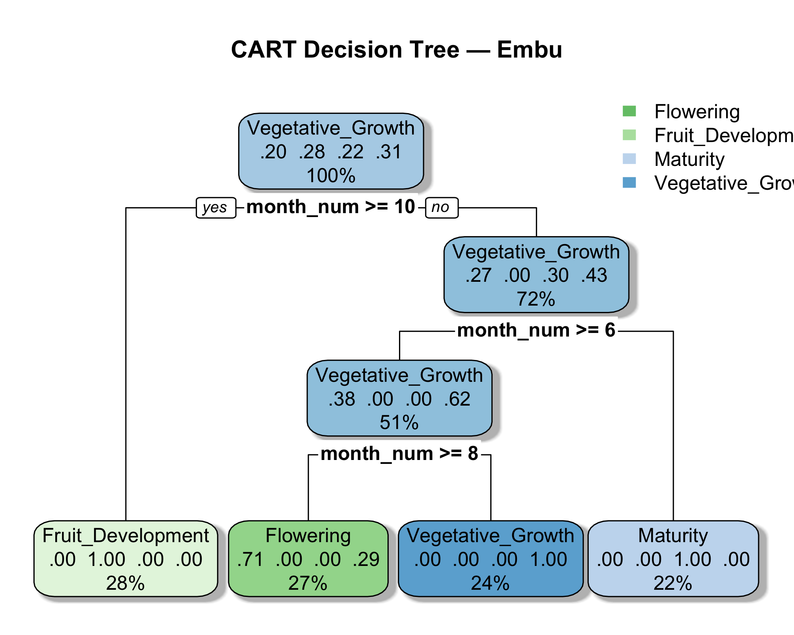
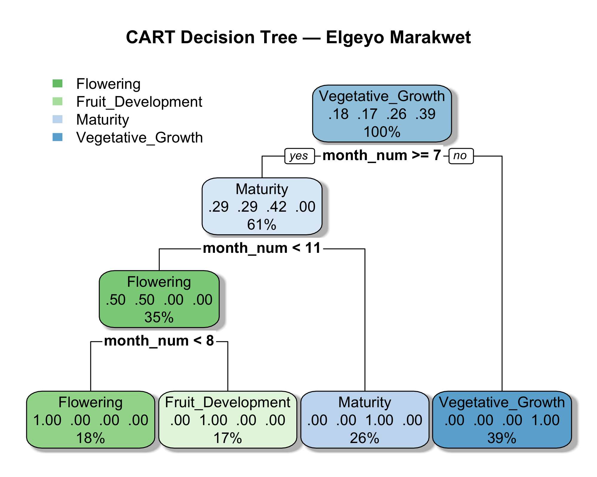
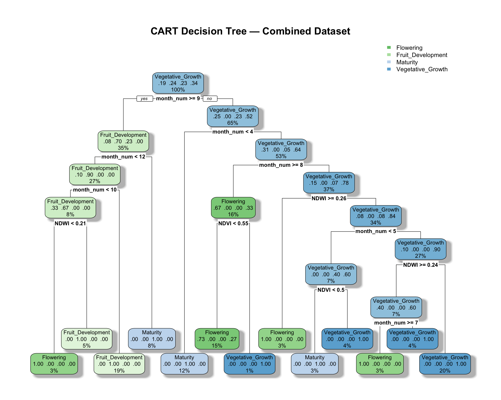

# Introduction

Avocado is one of Kenya’s most economically significant horticultural crops, accounting for over 40% of the country’s fruit export value and showing a five‑fold increase in export volumes between 2013 and 2022 [@hcd2023report]. The area under avocado cultivation has expanded by more than 200% over the past decade, reflecting widespread orchard establishment among smallholders. This expansion in acreage has been accompanied by a sharp rise in national production, from ~70,000 tonnes to over 170,000 tonnes, driven by strong international demand and the rapid adoption of Hass avocado. 

Despite this growth, premature harvesting remains widespread, largely because farmers and value‑chain actors lack scalable, objective tools for determining physiological maturity across diverse smallholder orchards. Traditional maturity assessments, such as destructive sampling and dry‑matter analysis. These are accurate but costly, labour‑intensive, and spatially limited, making them unsuitable for routine monitoring at regional scales [@whiley1986phenology; @salazar1998flowering].

Remote sensing offers a promising alternative. Multisensor satellite platforms such as Sentinel‑2 and Landsat 8/9 provide dense, high‑resolution time series capable of capturing canopy dynamics and phenological transitions in perennial crops [@bolton2021continental; @zhang2003monitoring]. However, applications in Kenyan smallholder systems remain limited due to heterogeneous canopies, intercropping, and variable management practices [@jaetzold2012farm].

Embu and Elgeyo Marakwet counties provide contrasting agroecological and socioeconomic contexts for evaluating such approaches. Embu is an established avocado‑producing region with strong market linkages, while Elgeyo Marakwet is an emerging production zone with expanding commercial interest [@jaetzold2012farm].

Objective 1 of this study is to demonstrate that fused Sentinel‑2 and Landsat spectral indices can be used to classify avocado phenological stages in Embu and Elgeyo Marakwet. This phenology classification provides the foundation for subsequent modelling of maturity timing and supports the development of scalable, spatially explicit decision‑support tools for Kenya’s avocado value chain.

# Methods

## Study area and field observations

The study was conducted in two major Hass avocado‑producing counties in Kenya: Embu and Elgeyo Marakwet. The counties differ in elevation, temperature regimes, rainfall patterns, and canopy moisture dynamics, providing contrasting ecological conditions for phenology monitoring [@jaetzold2012farm].

Farm‑level GPS points and digitized field boundaries were collected for all sampled orchards.

Phenology information was obtained through farmer‑reported observations collected using a structured KoboToolbox survey instrument. Farmers were asked to describe the dominant phenological state of their avocado trees at the time of each visit or interview. These descriptions were standardized and mapped onto four discrete phenology stages commonly used in avocado phenology literature:

- Flowering  
- Vegetative growth  
- Fruit development  
- Maturity

Published descriptions of Hass avocado phenology were used to interpret farmer responses and ensure that stage definitions were biologically consistent across Embu and Elgeyo Marakwet. Each observation was timestamped, and dates were converted into a continuous month number (1–12 + decimal fraction) to support temporal modelling and alignment with satellite observations.

## Satellite data acquisition

Sentinel‑2 MSI and Landsat 8/9 OLI surface reflectance products were accessed via Google Earth Engine. Cloud masking was performed using Sentinel‑2 Cloud Probability and CFMask, following established best practices for multisensor phenology monitoring [@roy2016landsat; @claverie2018harmonized].

Only cloud‑free pixels intersecting farm polygons were retained.

## Preprocessing and harmonization

To ensure radiometric comparability across sensors, all bands required for index computation were resampled to a common spatial resolution of 10 m. Sentinel‑2 20 m bands were downsampled, while Landsat 30 m bands were upsampled, following standard practice in multisensor harmonization.

For each image:

- cloud and shadow pixels were removed  
- acquisition dates were standardized  
- images were clipped to farm‑level polygons  

This produced harmonized, farm‑level time series suitable for phenology analysis [@roy2016landsat; @claverie2018harmonized].

## Fusion of Sentinel‑2 and Landsat

To increase temporal density, Sentinel‑2 and Landsat observations were fused into a single time series:

- all valid observations from both sensors were combined  
- no interpolation or smoothing was applied  
- original spectral values were preserved  

This fusion increased revisit frequency from 5–16 days to 3–5 days.

## Derivation of spectral indices

Vegetation indices (NDVI, EVI, NDWI, NDRE) were derived in GEE for each orchard polygon. These indices capture key physiological processes associated with avocado phenology [@huete2002modis; @gao1996ndwi; @gitelson2005remote].

## Remote sensing data and feature engineering

Time‑series vegetation indices were imported into R. Temporal features were engineered using:

- rolling means  
- rolling standard deviations  
- temporal lags  
- rate‑of‑change metrics  

All feature‑engineering steps were implemented in:

```
scripts/03_feature_engineering.R
```

## Temporal alignment of field and satellite data

Field observations were aligned with satellite dates using:

```
scripts/02_align_phenology.R
```

Each phenology observation was matched to the closest satellite date within ±3 days.

## CART model development

Three CART models were trained:

- Embu  
- Elgeyo Marakwet  
- Combined  

Training was performed using:

```
scripts/06_cart_models.R
```

## Model evaluation

Confusion matrices were generated using:

```
scripts/08_cart_confusion_matrices.R
```

## CART tree visualization

Decision trees were exported using:

```
scripts/09_plot_cart_trees.R
```

## Workflow overview and reproducible scripts

```{r}
library(tidyverse)
library(rpart)
library(rpart.plot)
library(caret)
library(knitr)
library(kableExtra)

source("scripts/01_load_data.R")
source("scripts/02_align_phenology.R")
source("scripts/03_feature_engineering.R")
source("scripts/06_cart_models.R")
source("scripts/08_cart_confusion_matrices.R")
source("scripts/09_plot_cart_trees.R")
```

# Results

## Vegetation Index Distributions Across Phenological Stages

Vegetation index distributions showed clear and biologically consistent stage‑wise patterns. NDWI exhibited the largest dynamic range, increasing by ~35–40% from Flowering to Fruit Development, reflecting rapid increases in canopy water content during early fruit expansion. NDVI and EVI increased by ~20–25% over the same transition, consistent with structural canopy development, but showed minimal change (<10%) between Fruit Development and Maturity. NDRE exhibited the smallest variation, with only ~10–15% change across the entire phenological cycle, reflecting stable chlorophyll levels in late‑season evergreen canopies.

```{r fig-boxplots, echo=FALSE, out.width="90%", fig.cap="Boxplots of NDVI, EVI, NDRE, and NDWI across stages"}
knitr::include_graphics("figures/boxplots_indices_true_stages.png")
```

## Effect Sizes and Sensitivity Ranking

Effect sizes (η²) indicated that NDWI was the strongest phenological discriminator (η² = 0.51), corresponding to a ~40% separation between Flowering and Fruit Development. NDVI and EVI showed nearly identical effect sizes (η² ≈ 0.46), reflecting ~20–25% structural differences across stages. NDRE had the lowest effect size (η² = 0.45), consistent with its ~10–15% chlorophyll variation.

```{r fig-effectsize-barplot, echo=FALSE, out.width="80%", fig.cap="Effect sizes for NDVI, EVI, NDRE, and NDWI"}
knitr::include_graphics("figures/effectsize_barplot.png")
```

```{r fig-radar, echo=FALSE, out.width="80%", fig.cap="Radar chart showing sensitivity of NDVI, EVI, NDRE, and NDWI"}
knitr::include_graphics("figures/effectsize_radar.png")
```

## Stage‑Pair Separability

Tukey HSD comparisons showed that Flowering was significantly different from both Fruit Development and Maturity across all indices. The smallest separability occurred between Fruit Development and Maturity, where spectral differences were <15%, confirming that late‑season physiological changes are subtle and harder to detect.

```{r fig-heatmap, echo=FALSE, out.width="90%", fig.cap="Heatmap of Tukey HSD stage pair comparisons"}
knitr::include_graphics("figures/stagepair_heatmap.png")
```

## Confusion Matrices

Across models, Flowering achieved the highest recall (often >80%), reflecting its strong spectral distinctiveness. Misclassifications occurred primarily between Fruit Development and Maturity, consistent with their <15% spectral separation. Combined‑county models performed slightly better than county‑specific models, suggesting that pooling data improves generalizability.

```{r confusion-matrices}
cm_embu <- readRDS("data_clean/cm_embu.rds")
cm_elgeyo <- readRDS("data_clean/cm_elgeyo.rds")
cm_combined <- readRDS("data_clean/cm_combined.rds")

cm_embu
cm_elgeyo
cm_combined
```

## CART Tree Figures

```{r fig-cart-embu, echo=FALSE, out.width="90%", fig.cap="CART decision tree for Embu"}

```

```{r fig-cart-elgeyo, echo=FALSE, out.width="90%", fig.cap="CART decision tree for Elgeyo Marakwet"}

```

```{r fig-cart-combined, echo=FALSE, out.width="90%", fig.cap="Combined CART decision tree"}

```

Together, these results demonstrate that multisensor vegetation indices capture phenological transitions with sufficient sensitivity to support classification across contrasting agroecological zones.

# Discussion

The multispectral indices derived from harmonized Sentinel‑2 and Landsat imagery demonstrated strong and consistent sensitivity to phenological transitions in avocado orchards, aligning with previous work on perennial crop phenology [Zhang et al., 2003; Sakamoto et al., 2010]. NDWI emerged as the most informative index (η² = 0.51), reflecting the ~35–40% change in canopy water content during early fruit expansion. This is consistent with studies showing that water‑sensitive indices are effective indicators of fruit growth and canopy hydration in evergreen crops [Gao, 1996; Whiley, 1994].

NDVI and EVI showed nearly identical effect sizes (η² ≈ 0.46), capturing ~20–25% increases in canopy greenness and structure from Flowering to Fruit Development. Their limited sensitivity to late‑season transitions (<10% change) reflects saturation effects in dense evergreen canopies, a well‑documented limitation of broad‑band vegetation indices [Huete et al., 2002; Filippa et al., 2018]. NDRE exhibited the smallest variation (~10–15%) and weakest separability between Fruit Development and Maturity, consistent with relatively stable chlorophyll levels during late‑season physiological stabilization [Gitelson, 2005]. This suggests that red‑edge indices may be more useful for detecting early‑season transitions than late‑season maturity.

The stage‑pair heatmap and confusion matrices further confirmed that Flowering is the most spectrally distinct stage, while Fruit Development and Maturity are more similar. This pattern is consistent with phenological studies in other evergreen fruit crops, where early‑season transitions produce strong spectral signals but late‑season changes are subtle [Bolton et al., 2021; Whiley & Schaffer, 1994].

Overall, these findings demonstrate that NDWI provides the strongest phenological signal, NDVI and EVI offer largely redundant structural information, and NDRE contributes early‑season chlorophyll sensitivity. These insights have direct implications for remote‑sensing‑based decision‑support systems, particularly for detecting Flowering and early Fruit Development which are key management windows for irrigation, nutrient application, and pest risk assessment.

The consistency of results across two contrasting agroecological zones suggests that fused HLS data provide a robust basis for phenology classification in smallholder avocado systems. The ability to detect phenological transitions using freely available satellite data has important implications for maturity assessment, harvest planning, and decision‑support tools within Kenya’s avocado value chain. These findings provide a strong foundation for further research, which will focus on translating phenology signals into operational maturity models.

# Reproducibility

All data processing, feature engineering, model training, and figure generation steps are fully reproducible using the scripts in this repository.
Core analysis scripts are located in scripts/
Figure‑generation scripts (G01–G03) are located in scripts/figures/
Google Earth Engine preprocessing scripts used to extract and harmonize multisensor spectral indices are included in gee_scripts/
All figures included in this report were generated using the scripts above and saved in the figures/ directory. The computational environment used for knitting this document is shown in the Session Info section.

# Session info

```{r}
sessionInfo()
```

# References
